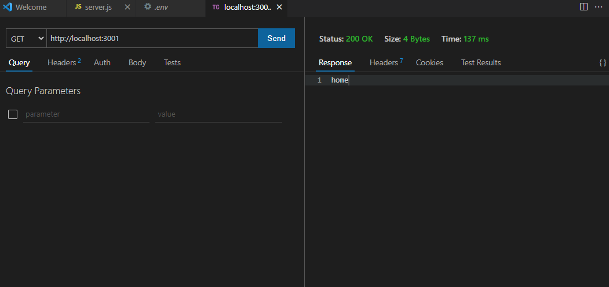
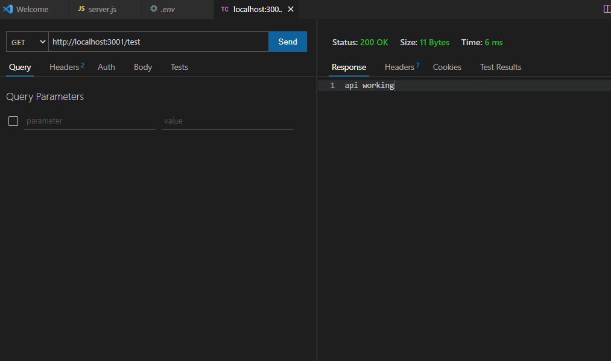
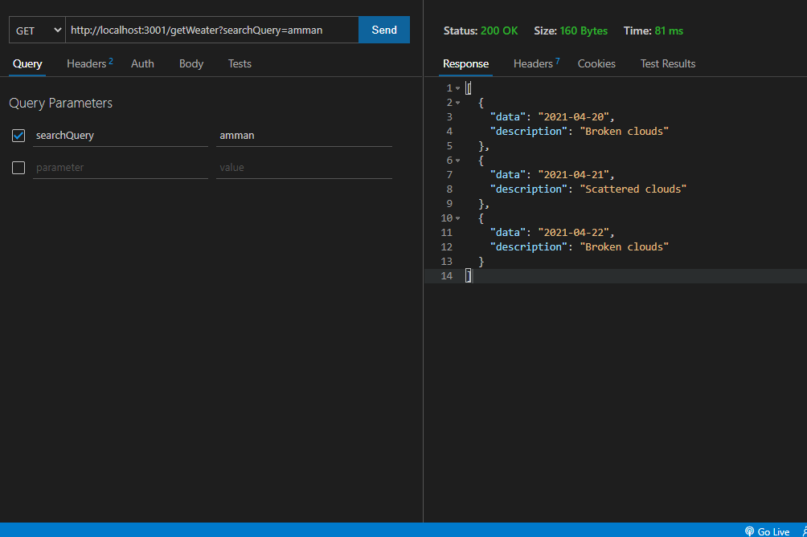
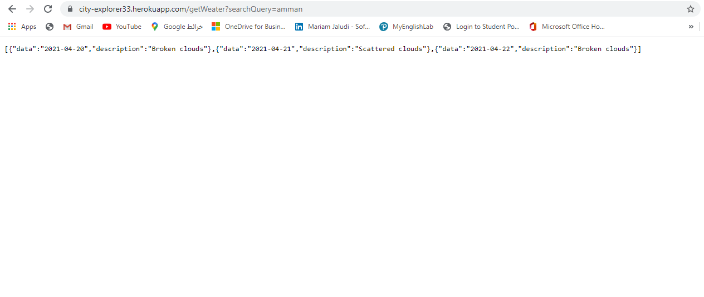

## Here i tested the backend server to check if it is working 

## Here i tested if the API is working as you see it is working good

## Here i tested if the Api bring me data or not and it was working and bring data as well

## Here i tested the backend and it bring me data in Heroku so its work good 

## Here the Server is waiting for a request 

## Here after i searched for a city there is array of data and they key 

## And here is the entity of each object

